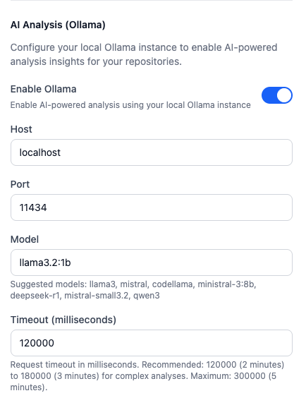

# Git Intelligence

A comprehensive full-stack web application for analyzing and visualizing Git repository statistics. Git Intelligence provides deep insights into project activity, contributor performance, codebase health, and repository evolution through an intuitive dashboard interface.

Currently it works only on local machines.

## 🚀 Features

### Core Analytics

- **Dashboard Overview**: Key metrics including total commits, contributors, file counts, and activity patterns
- **Activity Analysis**: Visualize commit patterns by hour, day, month, and year
- **Contributor Insights**: Track top contributors with commit counts, percentages, and activity windows
- **File Composition**: Language distribution analysis via file extension charts
- **Growth Tracking**: Monitor Lines of Code (LOC) history over time

### Advanced Analytics

- **Developer Analytics**:
  - Extended contributor metrics (lines added/removed, net lines)
  - Activity time windows (hour of day, day of week)
  - Signed commits percentage
  - Fix and revert commit ratios
  - Code churn metrics
  - Longitudinal patterns (author activity over time, onboarding curves, dormancy detection)

- **Risk Analytics**:
  - High-risk hotspots combining churn, complexity proxies, and ownership concentration
  - **Code Coverage Overlay**: Identify under-tested critical files by overlaying LCOV data
  - Temporal coupling hotspots (files that frequently change together)
  - Trend analysis of risky files to anticipate regressions

- **Technical Debt Indicators**:
  - Detection of huge, WIP, and "quick fix"/"temporary" commits
  - Identification of commented-out code, large binaries, and vendored code growth
  - Branch-level signals such as long-lived and excessively many branches

- **Codebase Health**:
  - **Hotspots**: Identify most frequently changed files and directories
  - **Change Coupling**: Detect files that change together
  - **Stability**: Analyze file age and change frequency
  - **Complexity**: Average diff sizes, largest diffs, most rewritten files

- **Repository Evolution**:
  - Commit frequency over time with **trendline analysis**
  - Release information (tags, dates, commit hashes)
  - Growth curves (LOC and files over time)
  - Change bursts (periods of high activity)
  - Churn metrics (additions, deletions, net change)
  - Monthly aggregation for long-term trend visualization

- **Bus Factor & Ownership**:
  - Single maintainer risk analysis
  - Fragmentation detection (files with too many contributors)
  - Owner churn tracking (files that changed primary maintainer)

- **Social Network Analysis**:
  - Collaboration graphs (network of contributors)
  - Knowledge silos detection
  - Orphaned code identification

### Cross-Repository Analytics

- Aggregated metrics across all repositories in a project
- Cross-repo collaboration patterns
- Repository clusters (repos worked on by same teams)
- Synchronization patterns (commits across repos on same dates)
- Portfolio-level views of organization-wide activity, unstable/dying repositories, and overloaded contributors

### Batch Analysis & Jobs

- **Analyze All**: Trigger all analysis types for a repository or project with a single click
- **Background Processing**: Long-running analyses run in a background queue
- **Real-time Progress**: Monitor analysis progress with detailed status updates and percentage completion

### Project Management

- **Multi-Project Support**: Organize repositories into projects
- **Repository Upload**: Upload ZIP archives of Git repositories for analysis
- **Path-Based Analysis**: Analyze local Git repositories by path
- **Caching**: Intelligent caching of analysis results for faster performance

### AI-Powered Analysis (Optional)

- **Ollama Integration**: Use local AI models for enhanced insights
- **Intelligent Analysis**: Get natural language insights for codebase health, developer analytics, and repository evolution
- **Privacy-First**: All AI processing happens locally - no data sent to external services
- **Configurable**: Customize host, port, model, and timeout settings
- **Connection Testing**: Built-in connection test to verify Ollama setup

## 🏗️ Architecture

### Monorepo Structure

```
git-intelligence/
├── client/          # React frontend application
├── server/          # Node.js/Express backend API
└── package.json     # Root package with workspace scripts
```

### Technology Stack

#### Frontend (`client/`)

- **Framework**: React with TypeScript
- **Build Tool**: Vite
- **Routing**: TanStack Router (file-based routing)
- **Styling**: Tailwind CSS
- **Charts**: Recharts
- **State Management**: React Context API
- **UI Components**: Headless UI, Heroicons, Lucide React
- **Tables**: TanStack React Table

#### Backend (`server/`)

- **Runtime**: Node.js (v22+)
- **Framework**: Express
- **Language**: TypeScript
- **Git Operations**: simple-git
- **Database**: LowDB (JSON-based with schema versioning)
- **File Upload**: multer
- **ZIP Handling**: adm-zip
- **Testing**: Vitest

## 📦 Installation

### Prerequisites

- Node.js (v22 or higher)
- npm or yarn
- Git
- **Ollama** (optional, for AI-powered analysis features)
  - Download and install from [https://ollama.ai](https://ollama.ai)
  - Recommended models: `llama3`, `mistral`, or `codellama`

### Setup

1. **Clone the repository**

   ```bash
   git clone <repository-url>
   cd git-intelligence
   ```

2. **Install all dependencies**

   ```bash
   npm run install:all
   ```

   This installs dependencies for the root, client, and server packages.

3. **Set up Ollama (optional, for AI-powered analysis)**

   If you want to use AI-powered analysis features:

   a. **Install Ollama**
   - Download from [https://ollama.ai](https://ollama.ai)
   - Follow installation instructions for your platform

   b. **Start Ollama service**

   ```bash
   ollama serve
   ```

   By default, Ollama runs on `http://localhost:11434`

   c. **Install a model** (choose one based on your needs):

   ```bash
   # General purpose (recommended)
   ollama pull llama3

   # Alternative options
   ollama pull mistral      # Fast and efficient
   ollama pull codellama    # Code-focused model
   ```

   d. **Configure in Git Intelligence**
   - Open the application and navigate to the **Settings** page via the sidebar
   - Navigate to the "AI Analysis (Ollama)" section
   - Enable Ollama integration
   - Configure host (default: `localhost`), port (default: `11434`), and model name
   - Click "Test Connection" to verify your setup

   Example settings configuration:

   

## 🚀 Usage

### Development

Start both the frontend and backend concurrently:

```bash
npm run dev
```

- **Backend**: Runs on `http://localhost:3001`
- **Frontend**: Runs on `http://localhost:5173`

### Production Build

```bash
# Build frontend
cd client && npm run build

# Build backend
cd server && npm run build

# Start backend
cd server && npm start
```

### Adding Repositories

1. **Create a Project**: Navigate to the Projects page and create a new project
2. **Upload Repository**:
   - Select a project
   - Upload a ZIP archive containing a Git repository
   - The system will automatically extract and detect the repository
3. **Add by Path**:
   - Provide the absolute path to a local Git repository
   - The repository will be linked to your project

### Viewing Analytics

- Navigate to different analytics views from the sidebar
- Select a repository to view single-repository analytics
- Select a project to view cross-repository analytics
- Use the refresh option to bypass cache and get fresh data
- Use the **Analyze All** feature to trigger comprehensive background analysis for a repository or project

## 🧪 Testing

The backend includes comprehensive test coverage using Vitest:

```bash
# Run all tests
cd server && npm test

# Run tests in watch mode
cd server && npm run test:watch

# Generate coverage report
cd server && npm run test:coverage
```

## 📁 Project Structure

### Frontend (`client/src/`)

- `routes/` - File-based routing with TanStack Router
- `components/` - React components for visualization and UI
- `context/` - React Context providers (AppContext, NotificationContext)
- `api.ts` - API client with TypeScript interfaces

### Backend (`server/src/`)

- `index.ts` - Express server setup and API routes
- `git/` - Modular Git analysis functions
  - `stats.ts` - Basic statistics
  - `developerAnalytics.ts` - Developer metrics
  - `codebaseHealth.ts` - Codebase health analysis
  - `repositoryEvolution.ts` - Evolution metrics
  - `busFactor.ts` - Bus factor analysis
  - `socialNetwork.ts` - Social network analysis
  - `coverage.ts` - Code coverage parsing (LCOV)
- `db/` - Database modules
  - `database.ts` - LowDB initialization and migrations
  - `projects.ts` - Project CRUD operations
  - `repositories.ts` - Repository CRUD operations
  - `cache.ts` - Analysis result caching

## 🔧 Configuration

### Ports

- Backend: `3001` (configured in `server/src/index.ts`)
- Frontend: `5173` (Vite default)

### Database

- Database file: `server/db.json`
- Automatic schema migrations from older versions
- Cache stored in database for faster subsequent analyses

## 📊 API Endpoints

### Projects

- `GET /projects` - List all projects
- `GET /projects/:id` - Get project by ID
- `POST /projects` - Create project
- `PUT /projects/:id` - Update project
- `DELETE /projects/:id` - Delete project

### Repositories

- `GET /repositories` - List repositories (optional `?projectId=<id>` filter)
- `GET /repositories/:id` - Get repository by ID
- `POST /repositories` - Add repository
- `DELETE /repositories/:id` - Remove repository
- `POST /upload` - Upload ZIP archive

### Analytics

- `GET /stats?path=<repo-path>` - Basic statistics
- `GET /developer-analytics?path=<repo-path>` - Developer analytics
- `GET /codebase-health?path=<repo-path>` - Codebase health
- `GET /repository-evolution?path=<repo-path>` - Repository evolution
- `GET /bus-factor-and-ownership?path=<repo-path>` - Bus factor analysis
- `GET /social-network-analysis?path=<repo-path>` - Social network analysis
- Cross-repo variants available with `?projectId=<id>` parameter

All analytics endpoints support `?refresh=true` to bypass cache.

### Settings (Ollama Integration)

- `GET /settings/ollama` - Get current Ollama settings
- `PUT /settings/ollama` - Update Ollama settings
  - Body: `{ enabled?: boolean, host?: string, port?: number, model?: string, timeout?: number }`
- `POST /settings/ollama/test` - Test Ollama connection
  - Body (optional): `{ host?: string, port?: number, model?: string, timeout?: number }`
  - Uses current settings if body is not provided

## 🎨 Features in Detail

### Dashboard

The main dashboard provides an overview of repository statistics with interactive charts showing:

- Activity patterns (hourly, daily, monthly, yearly)
- Top contributors with percentages
- File extension distribution
- Lines of Code history

### Developer Analytics

Deep dive into contributor behavior:

- Code contribution metrics (additions, deletions, net change)
- Activity patterns (when contributors are most active)
- Code quality indicators (signed commits, fix/revert ratios)
- Churn analysis
- Longitudinal patterns showing how contributors evolve over time

### Codebase Health

Identify potential issues and maintenance hotspots:

- Files and directories with high change frequency
- Files that change together (coupling)
- File stability analysis
- Complexity metrics

### Repository Evolution

Track how your repository grows and changes:

- Commit frequency trends
- Release history
- Growth curves
- Change bursts (periods of intense activity)
- Churn metrics

### Bus Factor & Ownership

Assess knowledge concentration risks:

- Single maintainer risk (files/repos with one primary contributor)
- Fragmentation (files with too many contributors)
- Owner churn (files that changed primary maintainer)

### Social Network Analysis

Understand collaboration patterns:

- Collaboration graphs showing contributor relationships
- Knowledge silos (files with limited contributor access)
- Orphaned code (files with no recent activity)

## 🤝 Contributing

Contributions are welcome! Please feel free to submit a Pull Request.

## 📝 License

This project is licensed under the MIT License - see the [LICENSE](LICENSE) file for details.

## 🙏 Acknowledgments

Built with modern web technologies and designed to provide comprehensive insights into Git repository activity and health.
